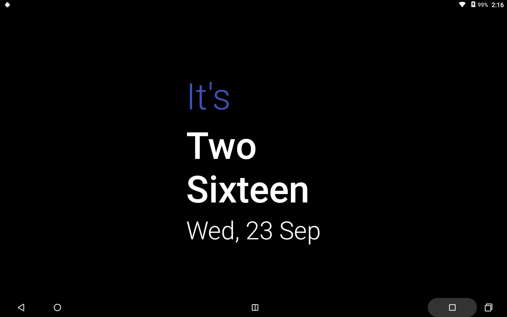
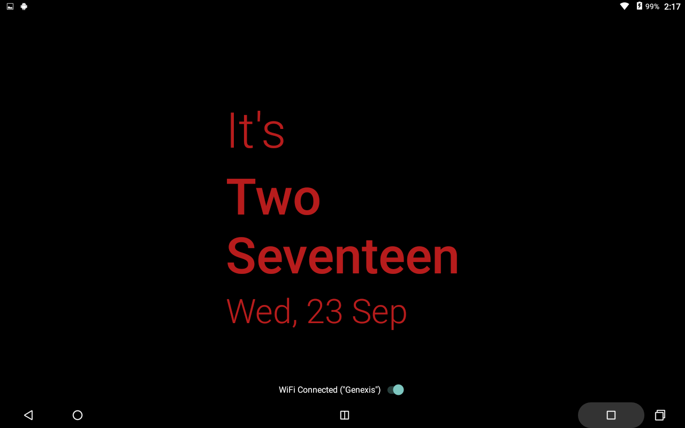

# Transformer Dashboard
## Features
1. Display time in an elegant manner.
2. Always-on display with auto-immersive.
3. The clock moves around every 2 minutes to avoid screen burn-in.
4. Night mode is enabled from 12AM to 7AM. Reducing the brightness and changing color to red.
5. The header 'It's' color keeps changing every minute.
6. Wi-Fi switch added to toggle Wi-Fi.
7. Auto turn-off Wi-Fi, if disconnected for more than 2 minutes to save battery.
8. More features planned to come...
## Screenshots
#### Normal Mode Clock

    

#### Night Mode Clock

    

